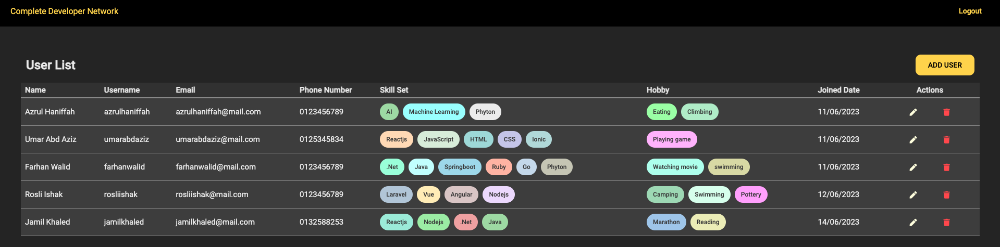
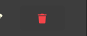

# Complete Developer Network

Complete Developer Network is an Angular project that allows administrators to manage freelance users. The project provides features for user login, displaying a user list, adding users, updating user information, and deleting users.

## Features

- **User Login**: Administrators can log in to the system using their credentials.
- **User List**: After logging in, the system redirects administrators to the home page where they can view a list of freelance users.
- **Add User**: Administrators can add new freelance users by providing the necessary details such as name, email, and skills.
- **Update User**: Administrators can update user information such as name, email, and skills for existing freelance users.
- **Delete User**: Administrators can delete freelance users from the system.

## Screenshots

### Home Page - User List


### Add User


### Update User


### Delete User


## Angular Part
## Getting Started

To run this project locally, follow the steps below:

1. Clone the repository:

```shell
git clone https://github.com/your-username/complete-developer-network.git

# UserManagement

This project was generated with [Angular CLI](https://github.com/angular/angular-cli) version 13.0.4.

## Development server

Run `ng serve` for a dev server. Navigate to `http://localhost:4200/`. The app will automatically reload if you change any of the source files.

## Code scaffolding

Run `ng generate component component-name` to generate a new component. You can also use `ng generate directive|pipe|service|class|guard|interface|enum|module`.

## Build

Run `ng build` to build the project. The build artifacts will be stored in the `dist/` directory.

## Further help

To get more help on the Angular CLI use `ng help` or go check out the [Angular CLI Overview and Command Reference](https://angular.io/cli) page.
